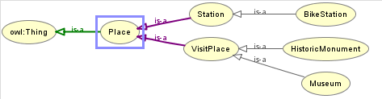

# Bike Touristic Tour

(Web Datamining & Semantics final project)


Made by [Florent Drilhon](https://github.com/florentdrilhon), [Paul Jouët](https://github.com/pauljouet) and [Aladin Homsy](https://github.com/aladeen57)


## Summary

-  [Overview](#-overview)
- 👀 [Project Demo](#-demo)
- 📝 [Installation Guide](#-how-to-install)
- 🛠 [Project construction](#-construction)


## Overview

Web application project that regroups in the same interface :

- bike-stations 🚲
- museums 🖼
- historical monuments 🏛

The goal is to create a web app that can be used for green touristic tour in Paris. The users sould be able to know where to rent a bike next to them, and what are the museum and historic buildings nearby. The application should provide useful information about the places to visit, and make itinerary recommandations to the user based on the availability of the bikes nearby and the possibility of leaving the bike near the monument/museum.

We chose to focus our application on Paris, to be able to do so we used queries on our collected and pre-precessed data.


## Demo

Here is a little demo of our platform (in local use)


## How to install

In order to run our web application, you need:

- the fuseki server
- the flask server
- the client

#### Install packages

The first step will be to setup the environment. The packages needed are the python modules listed in the server/requirements.txt file, and the npm packages for React.

The install-packages.bat script will take care of setting up an environment using venv if it does not exist, and install all requirements (might take some time as there are a lot of heavy packages with React). If you want to do it by hand:

```batch
pip install -r server\requirements.txt
```
for the python packages, and
```batch
cd client
npm install
```
for the react packages.

#### Setup Triplestore

We use Apache Fuseki as our triplestore. To download it, create the database and populate it, you can simply run the setup-fuseki.bat script (~5-6min). If there is an issue however, what it does is to:

- Download Fuseki using [this link](https://miroir.univ-lorraine.fr/apache/jena/binaries/apache-jena-fuseki-3.17.0.zip)
- Unzip the file and replace the shiro.ini file with the one in the root of our repo
- Start the server by running fuseki-server.bat
- Populate the database with populate-db.py using the pre-generated JSON-LD files

#### Launch the Web-App

Again, you can launch the webapp by running the start.bat script. You need to make sure that *there is no server running already* (if you ran setup-fuseki.bat before, the Fuseki Server might still be).

To do it by hand:

1) Run fuseki-server.bat
2) Run the app.py script into the server folder
3) Run npm start into the client folder

#### Success

You can now use the webapp !


## Construction

#### How to collect information

The information we need from the opensource databases are:

- the geolocation and adresses of the museums, historic monuments and bike stations
- names and descriptions for the places to visit
- number of bikes and room available for the stations
- identifiers

Our sources:

- bike api (real time) : https://www.velib-metropole.fr/donnees-open-data-gbfs-du-service-velib-metropole
for station_id, hasLatitude, hasLongitude, hasName and hasCapacity : https://velib-metropole-opendata.smoove.pro/opendata/Velib_Metropole/station_information.json for station_id, hasAvailableBikes : https://velib-metropole-opendata.smoove.pro/opendata/Velib_Metropole/station_status.json
- historical monument dataset : https://www.data.gouv.fr/fr/datasets/monuments-historiques-liste-des-immeubles-proteges-au-titre-des-monuments-historiques/
- museums dataset : https://www.data.gouv.fr/fr/datasets/liste-et-localisation-des-musees-de-france/


Once the data is collected from these sources the first thing to do is to pre-process it in order to have only the needed information. To do so, the file server/fuseki_managements/get_data.py use python to create a mapping from the data collected and store it into JSON-LD files by adding our onlogy as context.

We created from scratch our own onlogy with Protégé, here is a little overview : 



Once done we saved it into a Turtle file to upload it into the knowledge base of fuseki.


#### Triplestore management


Once the data is inserted into the triplestore (fuseki), we had to define different protocols to manage the data in the knowledge base. The file server/fuseki_managements/manage_fuseki.py provides utility methods to connect to the triplestore, insert a JSON file or to make a query from a text file.

The functions defined in this file are used first to insert the JSON files into the database from the populate-db.py, and then to get the data of different types of ressources. To differentiate each type, we created respectively the files museum.py monument.py and bikeStation.py in the server/fuseki_managements/ folder to differentiate the methods related to each ressource.

As the bikeStations are realtime data, we created an additionnal function for this ressource to update the wanted data before displaying it.

The functions defined for each ressource are then gathered in the server/app.py file which is a REST-based API to communicate with the client.

#### Display the content

To display the content we chose to build a react APP in order to integrate a map to render the different GPS values. 

As introduced before, to get the data from the triplestore, the client will call the flask API that must be running (locally) during the process.

API url : http://localhost/api/getdata?filter=stations

where 'filter' can be replaced by 'monuments' or 'museums'.

To render the contents according to the right ressource, we defined custom react components in client/src/components where we precised how to render the elements, and we also included in the JSX (HTML) code the properties from the ontology we defined earlier.

The components are then called by the client/src/App.js file to integrate them according to their localisations in the map.


